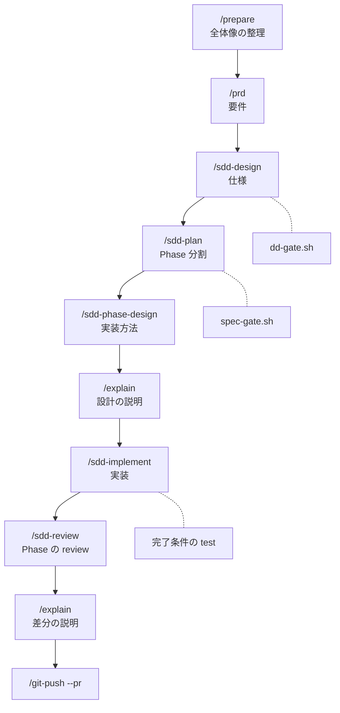
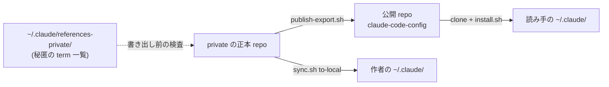

# claude-code-config

Claude Code を毎日の開発で使うための設定一式。計画から実装、レビュー、push までを Claude Code の中で進める。

## 目的

- 「こういう設定でこう使っている」を URL 1 つで伝えるために公開している
- 読んで参考にしても、必要な部分を自分の `~/.claude/` へ copy してもよい
- 正本 (この設定の原本) は別の private repo にあり、この repo には直接 commit しない

## 特徴

### 開発の流れ

- **計画から実装までを command で段階分けする**
  - 要件は `/prd`、仕様は `/sdd-design`、PR 分割は `/sdd-plan`、Phase ごとの実装方法は `/sdd-phase-design`
  - 実装は `/sdd-implement`、review は `/sdd-review`、設計と差分の理解は `/explain`
- **段ごとに機械判定の script を置く**
  - 仕様書は `scripts/dd-gate.sh`、作業の計画書は `scripts/spec-gate.sh` が形式を判定する
- **「設計書書いて」のような言い方で command を起動する**
  - 言い方と command の対応表を `CLAUDE.global.md` に置き、session 開始時に読み込ませる
- **agent への委譲を表で決める**
  - 独立した作業の数で、そのまま実装するか agent を並列で実行するかを決める

### 文章と命名

- **日本語の文体を hook で検査する**
  - hook は tool の実行前後や応答の終了時に Claude Code が実行する script を指す
  - chat 応答と file 書き込みの両方に NG 語の辞書 (`guidelines/writing/NG-DICTIONARY.md`) を当てて block する
- **関数名と変数名の付け方を決めておく**
  - repo で多く使われている語を使う、平易な英語を使う、削れる語は削る、の 3 基準
  - 変数は名詞、関数は動詞、bool は `is` / `has` で始める
  - 基準は `guidelines/common/code-quality-design.md`、言語別は `guidelines/languages/`

### 編集と安全

- **Serena MCP を前提にした編集規約**
  - code を symbol 単位で扱う MCP server が編集と参照追跡を担い、built-in の Read / Edit は Serena に接続していないときだけ使う
- **秘匿情報を repo に書けない仕組み**
  - 社内の固有名や個人名の一覧を repo の外 (`~/.claude/references-private/`) に置き、hook が書き込みと commit 文面を検査する
- **設定の正本と `~/.claude/` を script で同期する**
  - `sync.sh` が repo の内容を `~/.claude/` へ反映し、backup を 3 世代保持する

## 使い方の例

### 変更の規模ごとの道順

| 規模                                  | 道順                    |
| ------------------------------------- | ----------------------- |
| 1 file の修正                         | `/dev` だけ             |
| 単一 service 内の機能追加             | `/prd`、`/plan`、`/dev` |
| 複数 service や DB が変わる大きい開発 | 下の図の道順            |

判定の基準は `references/design-phase-flow.md` にある。

### 大きい開発の道順



1. **要件を固める**: `/prepare` で issue の全体像を整理し、`/prd` で要件を記述する
2. **仕様書を作成する**: `/sdd-design` で受け入れ条件を先に表にする
3. **Phase (= PR) に分ける**: `/sdd-plan` で各 Phase に対象 / 対象外 / 完了条件を記述する
4. **実装方法を決める**: `/sdd-phase-design --phase 1` で既存 code を調べてから関数名 / interface / SQL 方針 / テスト観点を決める。判断の無い単純な Phase では省略する
5. **実装する**: `/sdd-implement --phase 1` で Phase 1 だけを実装し、完了条件の test を実行してから報告する
6. **review する**: `/sdd-review` で review し、`--fix` で指摘を修正する。`/explain` で差分の説明を受ける
7. **PR まで進める**: `/git-push --pr` で commit、push、PR 作成をまとめて実行する

### どの段でも動く文体の検査

- chat の文体が規範から外れると、stop hook が応答を止めて書き直しを求める
- file への書き込みも同じ辞書で検査するので、PR 本文や Design Doc も同じ文体になる

## 取り込み方

公開 repo は root に README と LICENSE を置き、設定本体は `claude-code/` dir に置いている。

### 全部を取り込む

```bash
git clone https://github.com/DaichiHoshina/claude-code-config.git
cd claude-code-config
./claude-code/install.sh              # ~/.claude/ の dir 作成と symlink
./claude-code/sync.sh to-local --yes  # repo の内容を ~/.claude/ へ反映
```

既に自分の `~/.claude/` がある場合も、`sync.sh to-local` は上書き前に backup を作る。事前に `--dry-run` で差分を確認できる。

### 一部だけ取り込む

該当 dir の file を自分の `~/.claude/` の同じ場所へ copy する。

- command と skill の多くは `references/` や `guidelines/` の file を参照する (commands 48 件のうち 40 件)。参照先も併せて copy する
- hook は `templates/settings.json.template` の `hooks` 節と対で動くので、settings も合わせる

### 正本との関係

この repo は private の正本から選別して書き出したもので、更新は書き出しのたびに 1 commit で入る。



## dir 構成

以下はすべて `claude-code/` 配下の path。全体の入口は `CLAUDE.global.md` (`~/.claude/CLAUDE.md` の元) にあたる。

| dir              | 役割                                                                                 |
| ---------------- | ------------------------------------------------------------------------------------ |
| `commands/`      | slash command の定義 (`/plan` / `/dev` / `/review` / `/sdd-design` など)             |
| `skills/`        | 特定の作業手順を定義した skill (`writing-knowledge` / `comprehensive-review` / `root-cause` など) 12 件 |
| `agents/`        | explore / developer / reviewer などの agent 定義                                      |
| `hooks/`         | PreToolUse / Stop などの hook script と、その lib                                     |
| `rules/`         | auto-load される短い規範 (思考原則 / 質問抑制 / 秘匿情報の block など)。11 件のうち 7 件は `paths:` で対象の言語や file 種別を限定する |
| `guidelines/`    | 言語別・文書別の詳細規範 (writing / backend / frontend)                              |
| `references/`    | command や rule から参照する詳細仕様と on-demand rule                                |
| `scripts/`       | 同期、機械判定、lint、memory 管理などの補助 script                                    |
| `lib/`           | script と hook が共有する関数                                                         |
| `templates/`     | settings.json や prompt の template                                                   |
| `output-styles/` | Claude Code の output style 定義                                                      |
| `githooks/`      | pre-push などの git hook                                                              |

## 取り込んだだけでは動かない機能

いくつかの機能は、repo に置けない機体固有の file を `~/.claude/references-private/` から読む。file が無いと、その機能は error を出さずに無効になる。取り込んだら最初にこの一覧を確認する。

| file                     | 有効になる機能                                   | 無いときの動作              |
| ------------------------ | ------------------------------------------------ | --------------------------- |
| `social-hit-terms.txt`   | 社内の固有名を外向き text で block する          | block しない                |
| `private-name-list.txt`  | 個人名 / 会社名を block する                     | block しない                |
| `extra-permissions.json` | 個人の環境に固有の permission を settings へ追加 | template の permission のみ |
| `repo-rules.json`        | repo ごとの rule の置き場と profile              | rule の読込を skip          |
| `large-repo-paths.txt`   | 大きい repo で delegation を促す判定             | 判定しない                  |
| `review-member/`         | team member の review 傾向の照合                 | 汎用 self-review のみ       |

- `install.sh` は `private-name-list.txt` が無いときだけ placeholder を作って警告する。残りの 5 件は自分で配置する
- 書式と置き場は `references/local-files-setup.md` にある

## License

非商用 license を採用している。`LICENSE` を参照する。
