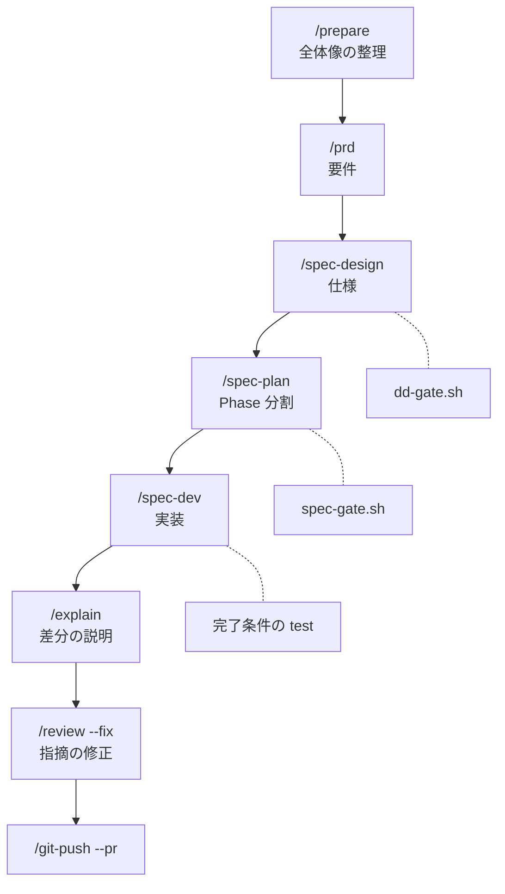
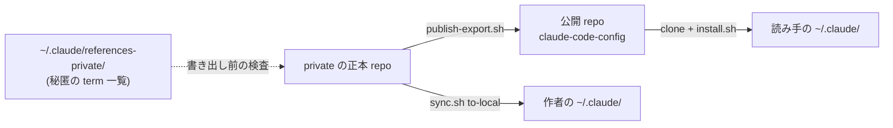

# claude-code-config

Claude Code を毎日の開発で使うための設定一式をまとめている。

- 内訳は commands / skills / agents / hooks / rules / guidelines を中心とした 12 dir
- 計画から実装、レビュー、push までを Claude Code の中で進める

## 目的

- 「こういう設定でこう使っている」を示すために公開している
  - 設定の説明を毎回書かず、この URL を渡せば伝わる状態を目指す
- 読んで参考にするだけでも、必要な部分を自分の `~/.claude/` へ copy しても使える
- 正本 (この設定の原本) は別の private repo にある
  - この repo には直接 commit しない

## 特徴

以下の hook は、Claude Code が tool の実行前後や応答の終了時に実行する script を指す。

- **日本語の文体を hook で検査する**
  - chat 応答と file 書き込みの両方に NG 語の辞書を当てて block する
  - 辞書は `guidelines/writing/NG-DICTIONARY.md`、規範は `guidelines/writing/PRINCIPLES.md`
- **計画から実装までを command で段階分けする**
  - 要件は `/prd`、仕様は `/spec-design`、PR 分割は `/spec-plan` が担当する
  - 実装は `/spec-dev`、差分の理解は `/explain` を使う
  - 定義は `commands/` にある
- **段ごとに機械判定の script を置く**
  - 仕様書の形式は `scripts/dd-gate.sh` が判定する
  - 作業の計画書の形式は `scripts/spec-gate.sh` が判定する
- **Serena MCP を前提にした編集規約**
  - code を symbol 単位で扱う MCP server が、編集と参照追跡を担当する
  - built-in の Read / Edit は Serena が未接続のときだけ使う
  - 規約は `CLAUDE.global.md` の「Serena 必須化」にある
- **agent への委譲を表で決める**
  - 独立した作業の数で、そのまま実装するか agent を並列で実行するかを決める
  - agent の定義は `agents/` にある
- **秘匿情報を repo に書けない仕組み**
  - 社内の固有名や個人名の一覧を repo の外 (`~/.claude/references-private/`) に置く
  - hook が file への書き込みと commit 文面を検査する
- **設定の正本と `~/.claude/` を script で同期する**
  - `sync.sh` が repo の内容を `~/.claude/` へ反映する
  - backup を 3 世代保持する

## 使い方の例

ある日の流れを示す。下の図は変更の規模で分かれる 3 つの道順のうち、大きい開発 (複数 service や DB が変わる変更) の道順だ。1 file の修正なら `/dev` だけ、単一 service 内の機能追加なら `/prd`、`/plan`、`/dev` の順に進む短い道順になる。どの道順を選ぶかの判定は `references/design-phase-flow.md` にある。



1. **要件を固める**
   - issue を読んで `/prepare` で全体像を chat に整理する
   - `/prd` で要件を記述する
2. **仕様書を作成する** (`/spec-design`)
   - 受け入れ条件を先に表にする
   - `scripts/dd-gate.sh` で合計行と表の一致を機械判定する
3. **Phase (= PR) に分ける** (`/spec-plan`)
   - 各 Phase に対象 / 対象外 / 完了条件を記述する
   - `scripts/spec-gate.sh` で 400 行超と想定行数の欠けを判定する
4. **実装する** (`/spec-dev --phase 1`)
   - Phase 1 だけを対象にする
   - 完了条件の test を実行してから報告を出力する
5. **差分を確かめて修正する**
   - `/explain` で差分の説明を受け、自分の言葉で説明できるか確かめる
   - `/review --fix` で指摘の修正を繰り返す
6. **PR まで進める** (`/git-push --pr`)
   - commit、push、PR 作成を 1 command でまとめて実行する

hook は上の流れのどの段階でも文体を検査する。

- chat の文体が規範から外れると、stop hook が応答を止めて書き直しを求める
- file への書き込みも同じ辞書で検査するため、PR 本文や Design Doc にも同じ文体が保たれる

## 取り込み方

公開 repo は root に README と LICENSE を置き、設定本体は `claude-code/` dir を保った構成で置いてある。

- **全部を取り込む**: clone してから `claude-code/` 配下の install script と sync script を実行する

  ```bash
  git clone https://github.com/DaichiHoshina/claude-code-config.git
  cd claude-code-config
  ./claude-code/install.sh              # ~/.claude/ の dir 作成と symlink
  ./claude-code/sync.sh to-local --yes  # repo の内容を ~/.claude/ へ反映
  ```

- **一部だけ取り込む**: 該当 dir の file を自分の `~/.claude/` の同じ場所へ copy する
  - command と skill の多くは `references/` や `guidelines/` の file を参照する (commands 48 件のうち 40 件)。1 file だけ copy すると参照先が欠けるので、参照先も併せて copy する
  - hook は `templates/settings.json.template` の `hooks` 節と対で動くため、hook を取り込むときは settings も合わせる
- **既に自分の `~/.claude/` がある**: `sync.sh to-local` は上書き前に backup を作る
  - 事前に `./claude-code/sync.sh to-local --dry-run` で差分を確認する

この repo は private の正本から選別して書き出したもので、更新は書き出しのたびに 1 commit で入る。正本と公開 repo と各人の `~/.claude/` の関係は下の図のとおり。



## dir 構成

以下の表はすべて `claude-code/` 配下の path を指す。

| dir              | 役割                                                                                 |
| ---------------- | ------------------------------------------------------------------------------------ |
| `commands/`      | slash command の定義 (`/plan` / `/dev` / `/review` / `/spec-design` など)             |
| `skills/`        | 特定の作業手順を定義した skill (`writing-knowledge` / `comprehensive-review` / `root-cause` など) 12 件 |
| `agents/`        | explore / developer / reviewer などの agent 定義                                      |
| `hooks/`         | PreToolUse / Stop などの hook script と、その lib                                     |
| `rules/`         | auto-load される短い規範 (思考原則 / 質問抑制 / 秘匿情報の block など)。11 件のうち 5 件は `paths:` で対象の言語や file 種別を限定する |
| `guidelines/`    | 言語別・文書別の詳細規範 (writing / backend / frontend)                              |
| `references/`    | command や rule から参照する詳細仕様と on-demand rule                                |
| `scripts/`       | 同期、機械判定、lint、memory 管理などの補助 script                                    |
| `lib/`           | script と hook が共有する関数                                                         |
| `templates/`     | settings.json や prompt の template                                                   |
| `output-styles/` | Claude Code の output style 定義                                                      |
| `githooks/`      | pre-push などの git hook                                                              |

`CLAUDE.global.md` が `~/.claude/CLAUDE.md` の元で、全体の入口にあたる。

## 取り込んだだけでは動かない機能

いくつかの機能は、repo に置けない機体固有の file を `~/.claude/references-private/` から読む。

- この file が無いと、その機能は error にならず通知なく無効になる
- `install.sh` は `private-name-list.txt` が無いときだけ placeholder を作って警告を 1 行表示する。残りの 5 件は自分で配置する
- 6 件の書式と置き場は `references/local-files-setup.md` にある

| file                     | 有効になる機能                                 | 無いときの動作              |
| ------------------------ | ---------------------------------------------- | --------------------------- |
| `social-hit-terms.txt`   | 社内の固有名を外向き text で block する        | block しない                |
| `private-name-list.txt`  | 個人名 / 会社名を block する                   | block しない                |
| `extra-permissions.json` | 個人の環境に固有の permission を settings へ追加 | template の permission のみ |
| `repo-rules.json`        | repo ごとの rule の置き場と profile            | rule の読込を skip          |
| `large-repo-paths.txt`   | 大きい repo で delegation を促す判定           | 判定しない                  |
| `review-member/`         | team member の review 傾向の照合               | 汎用 self-review のみ       |

取り込んだ直後に検査が動いているように見えて動いていない、という状態を避けるため、最初にこの一覧を確認する。

## License

非商用 license を採用している。`LICENSE` を参照する。
